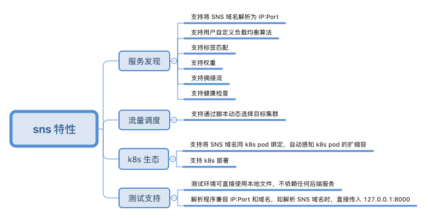
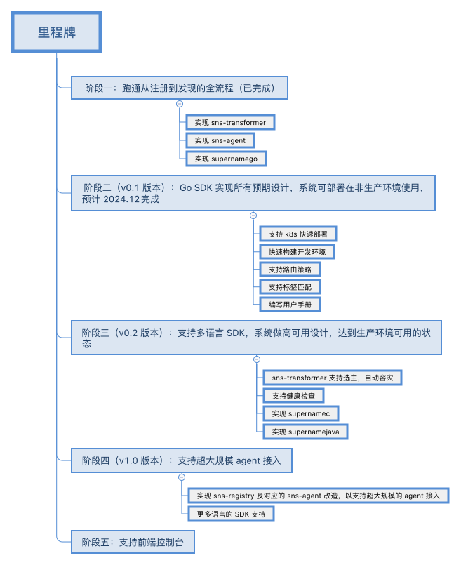

# SNS 总体设计

[toc]

## 1. 概述

### 1.1. 什么是 SNS？

SNS 是 super name system 的简称，是一个类似 DNS（domain-name-system）的服务发现系统。它提供了若干语言的 SDK：

* [supernamego](https://github.com/ironzhang/supernamego)
* supernamec(TODO)
* supernamejava(TODO)
* supernamepython(TODO)
* more

用户可以通过 SDK 将一个 SNS 域名解析为一个 IP:Port，以此达到服务发现的目的。

### 1.2. 为什么要做 SNS？

在互联网环境下，DNS 是一个非常成功的服务发现系统，但因其配置生效慢，不支持端口等特点，DNS 不是内网服务发现的最佳选择。SNS 的目标是构建一个专用于内网的、类似 DNS 的、具备灵活的流量调度能力的服务发现系统，帮助开发者更快速、更容易地构建和交付微服务。

### 1.3. SNS 特性概览

SNS 支持特性如下图所示：

图1 SNS 特性概览

## 2. 总体设计

### 2.1. 概念和术语

## 3. 开发路线图

