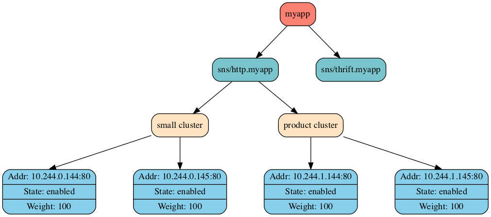
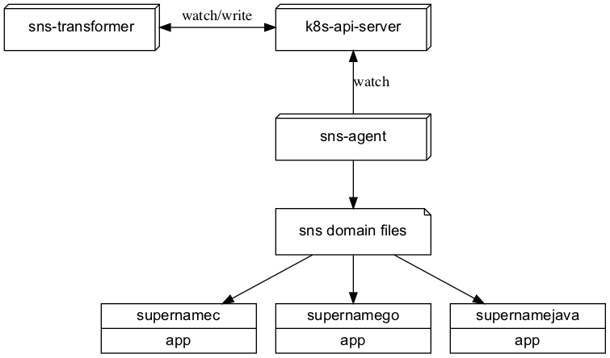

# SNS 总体设计

[toc]

## 1. 概述

### 1.1. 什么是 SNS？

SNS 是 super name system 的简称，是一个类似 DNS（domain-name-system）的服务发现系统。它提供了若干语言的 SDK：

* [supernamego](https://github.com/ironzhang/supernamego)
* supernamec(TODO)
* supernamejava(TODO)
* supernamepython(TODO)
* more

用户可以通过 SDK 将一个 SNS 域名解析为一个 IP:Port，以此达到服务发现的目的。

### 1.2. 为什么要做 SNS？

在互联网环境下，DNS 是一个非常成功的服务发现系统，但因其配置生效慢，不支持端口等特点，DNS 不是内网服务发现的最佳选择。SNS 的目标是构建一个专用于内网的、类似 DNS 的、具备灵活的流量调度能力的服务发现系统，帮助开发者更快速、更容易地构建和交付微服务。

### 1.3. SNS 特性概览

SNS 支持特性如下图所示：

图1 SNS 特性概览

## 2. 总体设计

### 2.1. 概念和术语

|中文|英文|释义|
|----|----|----|
|应用|application|应用代表一个可被部署的程序|
|集群|cluster|一个应用可按需求部署多个集群，以实现小流量、多活等能力|
|地址节点|endpoint|一个地址节点代表一个可以被访问的服务实例|
|SNS 域名|SNS domain name|可以被 SNS SDK 解析为 IP:Port 的一串字符串，如 sns/http.myapp|

图2 SNS 服务模型

如上图所示，一个应用可通过多个不同的域名来对外提供不同的服务，而一个域名下又可分为多个集群，如小流量集群、线上生产环境集群等，而一个集群下则包含多个地址节点。

### 2.2. 逻辑架构

SNS 系统的逻辑架构如下图所示：

图3 SNS 系统逻辑架构

各模块的职责如下表所示：

|模块|职责|
|----|----|
|k8s-api-server|作为数据存储中心使用，所有服务发现数据都存储在 k8s-api-server。|
|sns-transformer|转换程序，负责将 pod 等 k8s 原生资源转成供 sns-agent 订阅的自定义资源。|
|sns-agent|代理程序，负责订阅域名并更新到本机文件，以供 SDK 读取。|
|supernamec/supernamego/supernamejava|各语言 SDK，为用户提供将域名解析为 IP:Port 的功能。|

FAQ:

***为什么需要 sns-transformer 将 pod 资源转换成自定义资源，sns-agent 直接订阅 pod 资源不行吗？***

如果 sns-agent 直接订阅 pod 资源，那 SNS 将变成一个只支持发现 k8s 容器地址的服务发现系统，但我们希望 SNS 也能支持发现物理机，VIP:VPort 等各种地址。因此我们定义了 SNSCluster 资源来存储集群地址信息，sns-transformer 会自动抽取 k8s pod 资源中的 ip 和 port 信息，并将同一个集群的地址聚合到一起，转换为 SNSCluster 资源再写入 k8s-api-server，以此实现对 k8s 容器地址的原生支持，即按一定要求部署 k8s 容器，即可自动生成对应的 SNS 域名作服务发现之用。而物理机、VIP:VPort 等地址，则可通过 kubectl 手动写入 SNSCluster 资源来实现对这些地址的服务发现支持。

***为什么需要 sns-agent，SDK 直接去 k8s-api-server 订阅资源不行吗？***

这主要是考虑到 SDK 的实现成本以及今后更换数据存储中心的成本。如果让 SDK 直接去订阅 k8s-api-server 的话，就需要各个语言的 SDK 都引入 k8s client SDK，但 k8s client SDK 当前只有 go 语言有较好的支持，因此我们引入 sns-agent 来屏蔽这层影响，这样一来：

1. SDK 的开发成本大幅降低，有助于今后开发各个语言的 SDK。
2. 对 SDK 而言，隐藏了后台的 k8s 架构，今后只需跟 agent 交互即可，今后我们的后台架构即便有变动，也不会影响到 SDK，不需要应用系统升级 SDK，只需升级 agent 时保障兼容即可。

***SDK 为什么通过文件获取服务发现数据？***

之所以这样设计，主要是基于以下几点考虑：

1. 更好的可观测性：通过查看文件，即可知道下发给 SDK 的服务发现数据是否正确，排查问题更方便。
2. 更高的可用性：只要文件存在，SDK 即可解析出域名对应的地址，不强依赖 agnet 是否存活，agent 的存活只影响增量数据的更新，但不影响存量数据。
3. 更好的测试支持：某些测试场景下，直接构造文件即可测试，不需要在测试机器上安装 agent。

***为什么使用 k8s-api-server 作为数据存储中心？***

## 3. 开发路线图

图4 SNS 开发路线路

